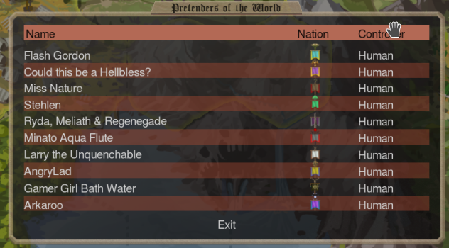
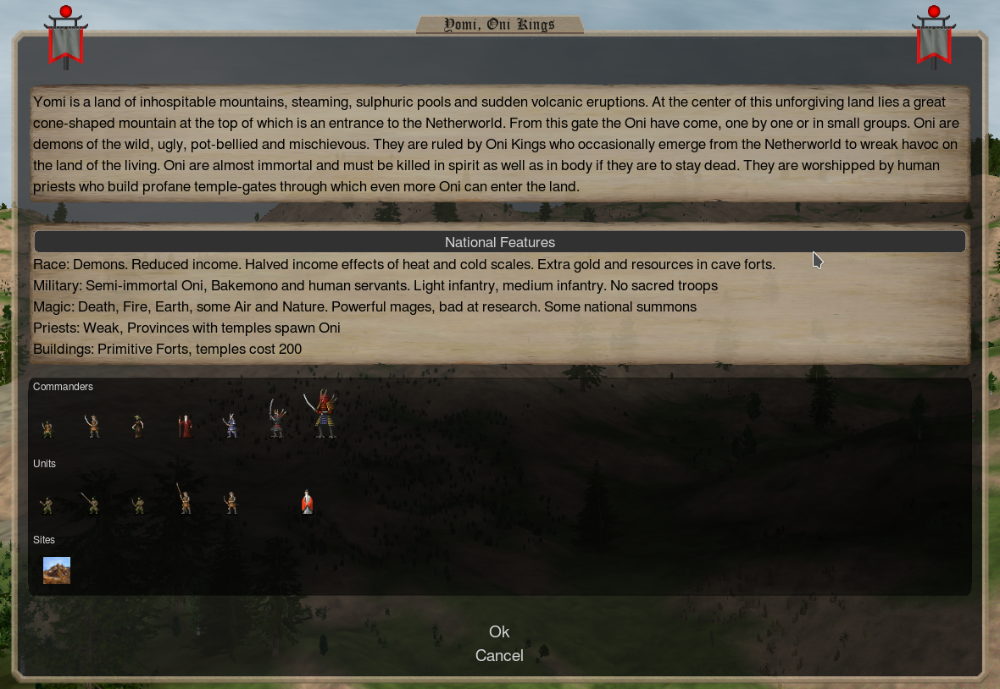
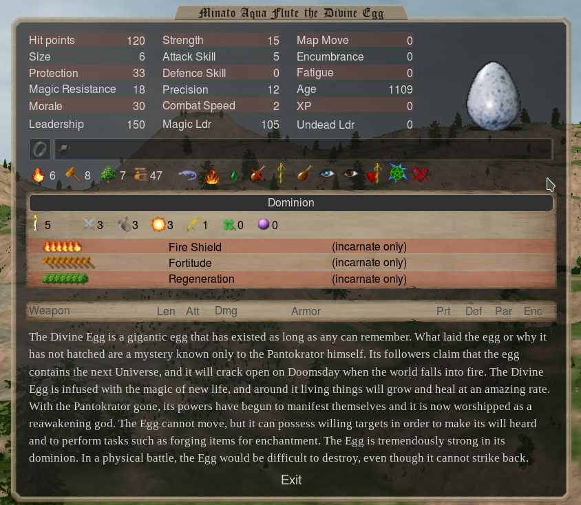

# Introduction

## Game Info
The game was organized at the Legio Domini Discord server.
EA game with mostly default configurations.
10 level 2 thrones on the map, 10 ascension points to win.

The game will run the ```Domimions Enhanced 171b.dm```.
It is a large vanilla-themed content mod with several contributors. It adds 20+ new nations, and hundreds of new spells and units.
It's probably very imbalanced and very _fun_.

First turn began on September 3 2020.

## Participants



* Lucienne d'Anwyl (Therodos)
* Kythira (Arcoscephale)
* 101 (Alchera)
* Dango (Yomi)
* Sturm (Ermor)
* Skipper (Sauromatia)
* Firekron (Albion)
* lourdes (Fomoria)
* DildoBaggins (Fennoscandia)
* Stehlen (Mictlan)

A total of 10 players are competing in this game. I have no idea how skilled they are.


## Chosen Nation: Yomi



### Pros
- Freespawn oni units that have chaos power. They are stronger in provinces with turmoil and unrest.
- The aforementioned freespawn oni also cause unrest automatically, so they get stronger when they sit on a province or enemy fort.
- Oni need to be killed twice.
- Dai Oni are basically giant armored badass necromancers.
- As with all death nations. They just need a bit of space to become spooky. After which they become very difficult to stop/contain.

### Cons
- Chaos power units such as oni are weaker in provinces with Order scales.
- All Oni except for properly geared shugo and dai oni get demolished by Priest 2+
- Income is reduced, further exacerbated by turmoil, sloth, and extreme temperature scales that I'll be taking.
- Yomi mages are expensive.
- Extremely vulnerable to hellbless strategies where enemy sacreds are beefed up hard enough to kill Dai Oni.


## Pretender Design

**Awake - Divine Egg for Yomi**



> The name "Minato Aqua Flute" is a reference to [⚓️ this BGM ⚓️](https://www.youtube.com/watch?v=bNBEgmsEXII).

### Scales:
Dominion 5, Turmoil 3, Sloth 3, Heat 3,  Growth 1, Luck 0, Magic 0

### Paths:
Fire 6, Earth 8, Nature 7

### Bless effects:
**Fire Shield**, **Fortitude**, **Regeneration**


## Rationale:

### Chassis
**Divine Egg** - Starts with Fire and Nature paths.

It has the Healer 1 perk, which is convenient for this nation as you can use it to remove afflictions from Dai Oni. It makes otherwise severely crippled Dai Oni ready for thug duty again.
Once I can cast **Hero Beacon** to recruit a commander with the healer perk, I can then have my pretender perform other duties.

It's an immobile pretender, however it's not _inanimate_. That means it can cast transformation spells that require the caster to be alive. This includes spells such as **Become Dragon**, **Become Golem**, **Become Giant**, **Transformation**, or **Become Worm That Walks**. Once transformed, it will be able to move on the map to join fights or claim thrones. I will most likely use **Become Golem**(Construction 7) or **Become Giant**(Alteration 6). Both forms are robust and have inventory slots for whatever equipment they might need.

### Scales

___
**Dominion 5**

I honestly wanted to push this higher (around 6 or 7), but I needed the points elsewhere and I figured this is manageable because of temple recruit demon priests I can use for preaching in case my own dominion becomes too low.

___
**Turmoil 3**

Oni have the chaos-power perk. In otherwords they fight better when there's tons of unrest

___
**Sloth 3**

Ideally this would be sloth 2 so that you can immediately start recruiting Dai Oni from turn 2 onwards.
However I'm sacrificing that 1 turn earlier Dai Oni expander for a bigger bless. I'm gambling on my bless being big enough to be worth it.

___
**Heat 3**

Yomi gets less of an income hit from extreme temperature scales so I'm putting it at max heat since my mages have fire paths and my sacreds have the __Fire Shield__ bless.

___
**Growth 1**

I need to mitigate the inevitable population loss from patrolling away unrest.
Unrest from turmoil 3, turmoil related random events, and Yomi's unrest generating units. Dai Oni are also very gold-intensive so keeping the population stable for income is a must.

___
**Luck 0 and Magic 0**

These are both very favorable scales for yomi that I'd ideally have, but I'm out of points.

___
### Bless

**Fire Shield**, **Fortitude**, **Regeneration**

The idea here is to make enemy melee units kill themselves by attacking my Fire Shield blessed sacreds. Meanwhile fortitude and regeneration are there to keep the sacred unit alive.

I initially considered using a similar build using the Idol of the Sun chassis, where I would take Fire Shield + Ethereal bless which would effectively make my sacreds into armored wannabe Fire Elementals. However I figured Fortitude and Regeneration was the safer option. I am unfamiliar with some of the mod nations the other players picked, but nations like Fennoscandia looked like they had very hard hitting units. Later on, it was pointed out that since the game included Therodos, I should have expected magic weapons being taken.


## Research Priorities

Rush **Construction 6** for dai oni thugging gear + research boosters + clockwork smiths (spam armor of knights, girdle of might, fire in a jar).

At least **Conjuration 4** for summoning Shikome.

**Thaumathurgy 4** for site searching and Hitobashira.

**Enchantment 7** for combat spells, global enchantments, battlefield enchantments, and skellies.

Later on, **Evocation 5** for access to spells such as Shadow Blast, and Earthquake.

**Alteration**/**Conjuration** for late game buffs and useful summons.
